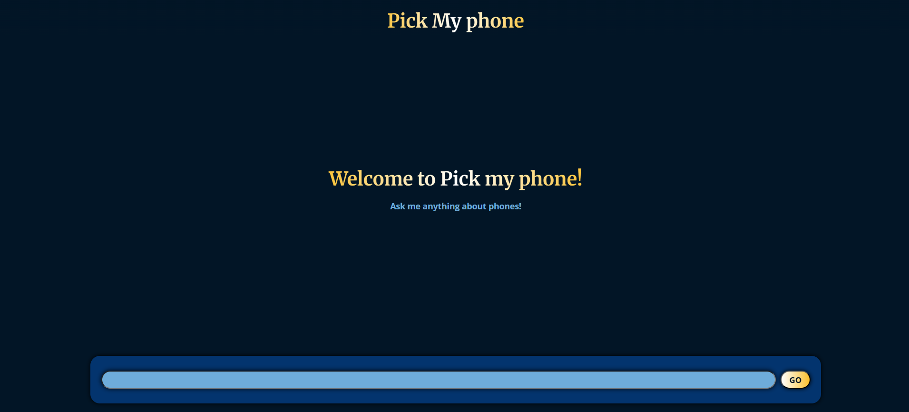
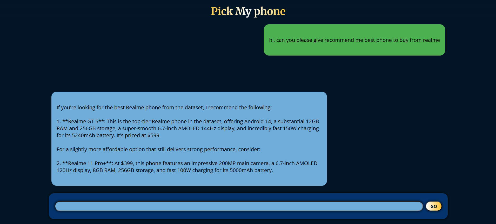

# Shopping Chat Agent (Mobile)

## Goal and Scenerio
Create an AI shopping chat agent that helps customers discover, compare and buy mobile phones.

The Agent should:
- Answer Natural language shopping queries.
- Compare models, explain trade-offs, and make recommendations.
- Be resilient to adversarial prompts and irrelavant queries.
- provide a simple web based chat interface with results display.

## Dataset used
/dataset/phones.json

## Screenshots
### Home Screen

### Chat Screen

